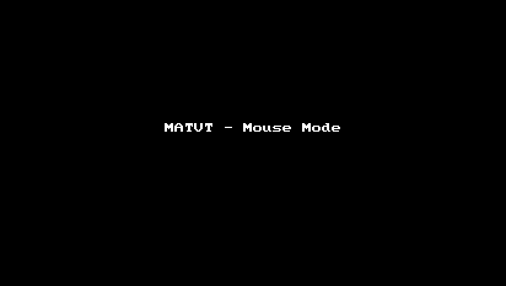
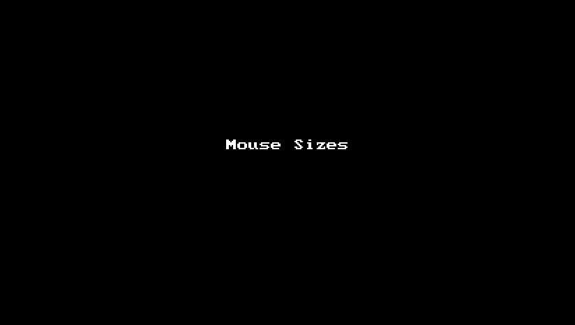

       

#### Please read the After Install instructions carefully otherwise you might end up soft-bricking yourself (it's possible to recover, but why do you want to risk it, eh?)

# MATVT: Mouse for Android TV Toggle (Now for flipphones as well)

Hard to reach portions of some legacy app that you're running on your Android TV (/flipphone)?
Feeling the need to have a touch input in your Android TV (/flipphone)?
Or just looking for an alternative to the famous Mouse Toggle App for your TV (/flipphone)?

MATVT solves all the above. Unfortunately, it's not on the playstore, and there are no plans to
launch it there either. If you'd like to see it on playstore, please let me know in the issues
tab (any support is also graciously accepted).

Official Releases (and pre-releases) can be seen at https://github.com/virresh/matvt/releases.  
The latest stable release fit for usage on TV can be downloaded at https://github.com/virresh/matvt/releases/latest.  

## So what does this app do?
MATVT is intended for users running Android TV / Flipphone (Android version 7+, limited functionality on Android 6 flipphone) and have a big remote with
atleast the following:
- DPAD (for up, down, left, right and center buttons)
- A spare key to toggle mouse mode (we call it the BossKey)
- <Optional> Color buttons (Red, Green, Yellow, Blue)
- <Optional> Info button

After installing this app, you'll get a mouse cursor that can move around, perform clicks and
left / right / up / down swipes from your remote itself without any extra hardware (no need to pair
with an android phone / laptop etc)

#### Basic Functionality

#### Mouse Warps over borders

#### Different Sizes and Skins

And a lot more functionality. See the configurations section

## How to install?
Download the APK from the releases section and side-load it on your TV.
The source-code is open and available should you wish to inspect it / build it yourself / don't
trust the release apk ;)

Remember there are two apks, one for Android TVs, one for Android FlipPhones. The one's without a `-phone` suffix are for flipphones, the others are for TVs.

## How to use?
- DPAD is for movement and single clicks (has long click support too, but isn't very reliable)
- The color buttons are for swiping. RED and GREEN for up/down swipe, YELLOW and BLUE for left/right swipe
- Info button will instantly toggle mouse visibility (so you can switch between mouse and no mouse instantly)
- ~~Pressing back button for more than 3 seconds will disable the accessibility service completely~~ This is now removed.
- The mouse will auto-disappear after a short while and re-appear when you press another relevant button.
- Toggling mouse modes resets cursor position
- The mouse warps around your TV sides, so you can roll over from the top of your TV to the bottom instantly
- Mouse movement is momentum based, so keeping key pressed for longer will increase the movement / send multiple swipes in scroll mode
- For remotes who don't have the above buttons, a `Boss Key` is available which can be used to toggle between mouse mode / scroll mode / dpad mode. By default this is the mute key, but can be overridden in the configuration settings. See the Youtube video linked below by TechDoctorUK for a demo of how that works.
- You can change the cursor icon used from the companion GUI app. It also supports several useful mouse configurations, detailed in a separate section below

See a demo of a modified version in action by TechDoctorUK at:
[https://youtu.be/UC7bPw2tG4c](https://youtu.be/UC7bPw2tG4c)

# Important points to know After Installing
- Be sure to go to Special App Permissions in your settings and give permission to MATVT to draw over
other system apps. If you don't do this step and enable the accessibility service beforehand, the app won't have
necessary permissions to do anything and it'll keep consuming your input, so your remote will no longer work.
If you have gotten yourself in this situation, see FAQ.
- *AFTER* doing the above, you can go to accessibility settings and enable MATVT service.
- Now you can press the info button and there you have your mouse

# Configurations available in the APP:
- Mouse Size
- Mouse Scroll Speed `**`
- Mouse Icon (two icons, light and transparent available)
- Bordered Window (Enabling this will prevent the cursor from warping over the screen edges)
- Disable Boss Key (If you have a full size remote, you don't need to keep a boss key. Info key and color buttons are sufficient, read how to use section for more info)
- Will Boss Key Toggle (When remotes don't allow long pressing, this will allow people to cycle through various modes on key press in the order: Dpad -> Mouse -> Scroll -> Dpad) `*`
- Override Activation Key (Select this to set a custom keyCode for bossKey)
- Scrolls when mouse touches the edges (thanks to [@sweenwolf](https://github.com/sweenwolf))
- Automatically detect boss key code (again thanks to [@sweenwolf](https://github.com/sweenwolf) !)

` *` Not available on FlipPhone version
`**` Not available on FlipPhones with Android 6.

# FAQs

- **Is this tested?**
  Yes, I have tested it on Sony Android TV. So any other Android TVs running Android 9 should work. If you've tested the official version on some other TV and it's working, please let me know, I'll create a list of TVs that are known to be working.

- **I didn't follow instructions properly and have soft-bricked myself, now what?**
  You'll need a physical mouse to go to accessibility services and disable MATVT. And this time before re-enabling it, please follow instructions and give the service proper permissions. You can also use a keyboard, but it'll be way more tedious.

- **I didn't follow instructions and was not soft-bricked, why all the warnings?**
  You should consider yourself lucky then :p. But be aware that the warnings are put there from a real experience. Though thanks to community contributions, this is probably fixed in some newer versions for most TV boxes.

- **So, how does it work?**
  You have the exact code in front of you, feel free to read it { It's not that bad ;) }. In a nutshell, this app uses Accessibility features provided by Android.

- **I think there's something that can be improved. How to contribute?**
  I welcome all kinds of contributions. Documentation, Code tests, Actual Hardware Testing etc etc. Please feel free to create a Pull request and remind me in a couple of weeks if I forget about it :D
  
- **Is there a version for Android Phones too?**
  While I believe this shouldn't be required on most touch screen Android phones, for those stuck with a non-touch screen Android phone, support for it is on the way. There's an experimental build available. Checkout discussion at https://github.com/virresh/matvt/issues/3 for more information.  
  
- **Are there ADs?**
  No, there are no ads, and there won't be any.  
  
- **Is there any kind of tracking information? Do you sell it for profit?**
  No, there is no tracking information collected from the app. No telemetry nothing. 
  
- **How do you sustain the project?**
  It's currently on Ad-Hoc basis. I devote my free time amongst my open source projects and maintain them. This project is not funded by anyone. It totally relies on community support. There have been generous folks (like @sweenwolf) who've contributed to the code base without any kind of compensation.

- **Mouse doesn't toggle with certain keys on chromecast?**
  Chromecast use infrared for some keys, which actually operates the TV, not the chromecast (like power, volume, mute buttons). There is a setting in chromecast to control chromecast audio instead of TV audio which should enable some of these keys, but in general the app cannot receive any IR key inputs unless your TV converts them to Android keycodes and sends it to the android operating system.  

# Redistributing and Creating MODs  

I welcome everyone who'd like to hack on the application, but I request everyone to stick by the following
- Please consider sending the enhancement to this project itself. I'm open to all enhancements and fixes. The whole point of making this app open source is so that folks have full access to the source code and don't have to pay anything for it.
- Please considering pointing to the latest releases from this repository itself, unless you explicitly want folks to download an old version. This prevents more people from downloading old versions and reporting bugs that might have been fixed.
- If you absolutely do not want to contribute back anything here, then please add a disclaimer to your distribution that it's bugs should not be reported here.
- By no means should you think that the source code being free means you can sell it. The source code is officially licensed under GPLv3, kindly abide by it's terms of use (it requires disclosing source code).
- If you want to make commercial application out of the project and for some reason need another license / cannot abide by terms of GPL, please file an issue to discuss.

**What would happen I don't do the above?**
Nothing. Frankly, I don't really care how people use this code. But eventually without community support or corporate backing, open source projects like this die, and this one will die too. A time will come when no developer would want to open source their projects because it's a total loss of time and spend their time making stuff behind paywalls.
Also keep in mind this project source has contributions from several people.

# Reporting Bugs
Please ensure to report bugs against an official release. It's hard for me to track down mods. Please try the latest official release before reporting a bug, just in case the latest version has fixed issues that you might be facing.  

# Contributing
All kinds of contributions are welcome. Two ways of contributing:  
- To contribute with your skills, please feel free to create a pull request in this repository. Bug reports can be done in the issues tab, and documentation happens similar to code contributions
- To sponsor the project, you can buy me a coffee via https://ko-fi.com/Z8Z74EEHQ and mention the specific bug / issue you're interested in. You can also use the button above.

# Credits
Thanks to EVA Facial Mouse for open sourcing their code. I've taken lots of ideas from their codebase. You can check them out at https://github.com/cmauri/eva_facial_mouse  
Thanks to [@sweenwolf](https://github.com/sweenwolf) for making this app work on remotes with less buttons, and for the app icons, fully transparent cursor images, boss key autodetect and autoscroll on borders!    
Thanks to [@aquirozc](https://github.com/aquirozc) for helping with scroll stability and toast message hiding.    
Thanks to [@ariehcore](https://github.com/ariehcore) for helping with confirm key option.    
Thanks to TechDoctorUK for making a demo video  
Thanks to @hotcereal_twitter for providing more cursor images. [Link](https://gitter.im/virresh/community?at=6102e7b0d8381a2a839bbcfd).    

# Disclaimer
Please note that this project in no way, shape or form is sponsored by anybody. It's a fully independent project with generous folks contributing to it.
It does not generate any kind of revenue. There are no ads in the app and will never be. There's no tracking code stealing information or any kind of paywall for *extra* features. It is what it is, unless of course you download a MOD. Unless the MOD is open source, there's no guarantee it'll follow the same spirit as the above. The only way to contribute is either by (A) fixing known issues / helping out with code or (B) sponsoring the project
